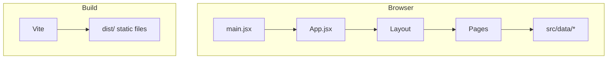

# Portfolio project — architecture & chatbot plan

This document describes the **current codebase**, how pieces fit together, and a **roadmap for adding an AI chatbot** that answers questions about you and helps visitors.

---

## 1. Project overview

| Item | Detail |
|------|--------|
| **Purpose** | Personal portfolio site: hero, about, projects, stack, contact, and a dedicated resume view. |
| **Stack** | React 18, Vite 5, React Router v6, Tailwind CSS 3, ESLint 9. |
| **Deploy target** | GitHub Pages (`homepage` in `package.json`: `https://prasannawarad.github.io/PortFolio`). |
| **Build** | `vite build` → static assets in `dist/`; `gh-pages -d dist` for publish. |

The app is a **client-side SPA**: there is no Node server bundled with the live site. Forms can use static-friendly services (e.g. Netlify-style form in `index.html`).

---

## 2. High-level architecture

- **Entry**: `index.html` loads `src/main.jsx`, which mounts `<App />` under `#root` with `StrictMode`.
- **Routing**: `BrowserRouter` wraps `Routes`. Shared chrome (`Navbar`, optional `Footer`, hash scrolling) lives in `Layout` via `<Outlet />`.
- **Content**: Long-form copy and structured facts live in `src/data/` (e.g. `experience.js`, `projects.js`, `stack.js`). `Home.jsx` composes sections and imports that data.
- **Styling**: Global styles in `src/index.css`; Tailwind via `tailwind.config.js` and PostCSS.

---

## 3. Directory structure (concise)

| Path | Role |
|------|------|
| `index.html` | Shell, fonts, favicon, Netlify-style hidden contact form, SPA mount. |
| `vite.config.js` | Vite + React plugin; `@` alias → `/src`. |
| `src/main.jsx` | React root. |
| `src/App.jsx` | Route definitions. |
| `src/components/` | Reusable UI: `Layout`, `Navbar`, `Footer`, `ProjectCard`, `TerminalWindow`, etc. |
| `src/pages/` | `Home` (main landing), lazy `Resume`. Standalone `About`, `Contact`, `Projects` components exist but are **not** wired in `App.jsx` today—the primary UX is **single-page sections** on `/`. |
| `src/data/` | `experience.js`, `projects.js`, `stack.js` — single source of truth for bio, projects, stack. |
| `src/assets/` | Images, SVG (e.g. branding). |
| `public/` | Static files (e.g. `404.html` for GitHub Pages). |

---

## 4. Routing & navigation

| Route | Page | Notes |
|-------|------|--------|
| `/` | `Home` | Full landing: sections `#about`, `#projects`, `#contact` (scroll targets). |
| `/resume` | `Resume` (lazy) | Code-split; `Layout` hides footer on this path. |

`Navbar` uses in-page anchors for About / Projects / Contact. `HashScrollHandler` aligns behavior for hash links and React Router navigation.

---

## 5. Data layer

- **`src/data/experience.js`** — Bio, education, technical/leadership experience, certifications, metrics, links (e.g. LinkedIn, GitHub, email).
- **`src/data/projects.js`** — `projects`, `homeFeaturedProjects`, GitHub base URL.
- **`src/data/stack.js`** — Stack columns for the home “stack” section.

Adding or editing portfolio facts should be done **here** (and optionally mirrored in any future chatbot knowledge file) to avoid drift.

---

## 6. Styling & UX

- **Tailwind** utility classes across components; `font-display` / monospace accents match a terminal-inspired theme.
- **Accessibility**: Sections use `aria-label`; semantic structure in page components.

---

## 7. Build & deploy

| Script | Action |
|--------|--------|
| `npm run dev` | Local dev server (Vite). |
| `npm run build` | Production bundle to `dist/`. |
| `npm run preview` | Preview production build locally. |
| `npm run deploy` | `predeploy` runs build, then `gh-pages -d dist`. |

**GitHub Pages SPA note**: `index.html` includes a small script to normalize certain GitHub Pages URL patterns so client-side routing works after refresh.

---

## 8. Chatbot plan

Goal: a **site-embedded assistant** that answers questions **about you and your work**, guides visitors (e.g. to projects or contact), and stays **honest** when information is missing.

### 8.1 Constraint: static hosting

The live site is **static files only**. The LLM API key **must not** ship to the browser. Options:

| Approach | Pros | Cons |
|----------|------|------|
| **Small serverless API** (e.g. Vercel/Netlify/Cloudflare Worker) | Key stays server-side; same React app can call `fetch` to your API. | Separate project or monorepo deploy; CORS and env setup. |
| **Backend-as-a-service** (e.g. managed chat API with server-side rules) | Less custom backend code. | Vendor lock-in, cost, privacy review. |
| **Client-only with public key** | Easiest prototype | **Not recommended** — key exposure and abuse. |

**Recommended:** keep the portfolio on GitHub Pages; add a **minimal `/api/chat`** (or equivalent) on a **serverless host** with `OPENAI_API_KEY` (or similar) in environment variables only.

### 8.2 Phased roadmap

**Phase 1 — MVP**

- UI: floating **chat button** + slide-over **panel** (matches existing Tailwind theme).
- Backend: one HTTPS endpoint that accepts `{ messages }`, calls the LLM with a **fixed system prompt** (“You only answer about Prasanna Warad using the provided facts; if unsure, say so and suggest Contact or GitHub.”).
- Knowledge: start with a **`profile.json` or markdown bundle** generated from `src/data/*` + short manual summary (single source of truth or build step to avoid duplication).
- Safety: max message length, rate limiting (per IP) on the serverless function, no secrets in the repo.

**Phase 2 — Better accuracy (RAG)**

- Chunk your bio/projects/stack text; **retrieve** top snippets per question (keyword search first; **embeddings + vector store** later).
- Pass retrieved snippets into the model so answers stay **grounded** and cite sections when useful.

**Phase 3 — Product polish**

- Quick actions: “Projects”, “Skills”, “Resume”, “Contact”.
- Handoff: hiring/collaboration questions → **mailto / contact form / LinkedIn** links.
- Optional: “Sources” links to `/#projects`, `/#contact`, etc.

**Phase 4 — Hardening**

- Stronger rate limits, optional analytics (aggregate question topics only), cost caps (model choice, max tokens).
- Process to **update knowledge** when `experience.js` / `projects.js` change (script or CI check).

### 8.3 Frontend integration (this repo)

- New components e.g. `src/components/ChatWidget.jsx` (or folder `chat/`).
- Mount the widget inside **`Layout.jsx`** so it appears on all routes (or exclude `/resume` if you prefer).
- Environment: **public** env var only for the **API base URL** (e.g. `VITE_CHAT_API_URL`), never the API key.

### 8.4 Open decisions (to lock before implementation)

- **Provider**: OpenAI, Anthropic, or another API compatible with your serverless runtime.
- **Streaming**: SSE or chunked responses for a typing effect (optional for v1).
- **Privacy**: whether to log prompts (default: avoid storing full transcripts).

---

## 9. Summary

The portfolio is a **Vite + React SPA** with **two routes**, data-driven sections on **`Home`**, and **static deployment to GitHub Pages**. The chatbot should use a **server-side API** for the LLM, a **small grounded knowledge layer** from your existing `src/data` content, and a **floating chat UI** integrated through `Layout`—implemented in phases from MVP to RAG and hardening.
